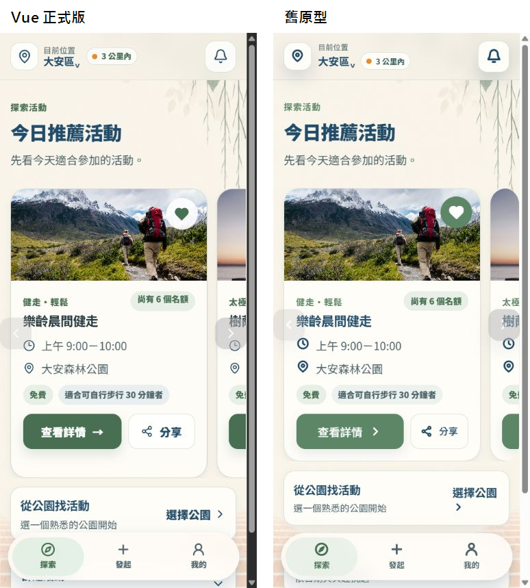
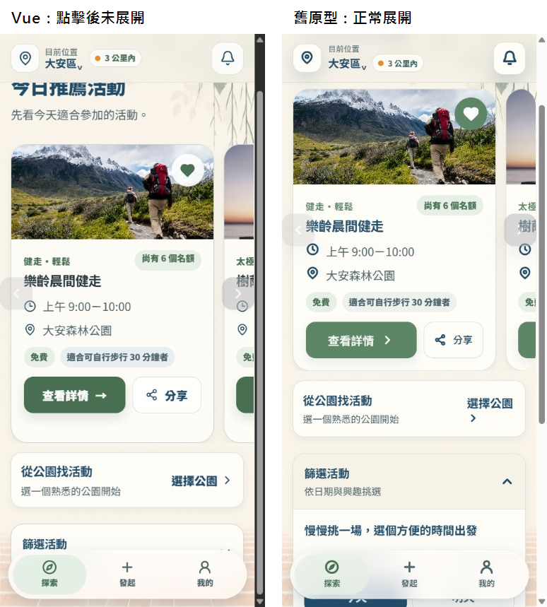
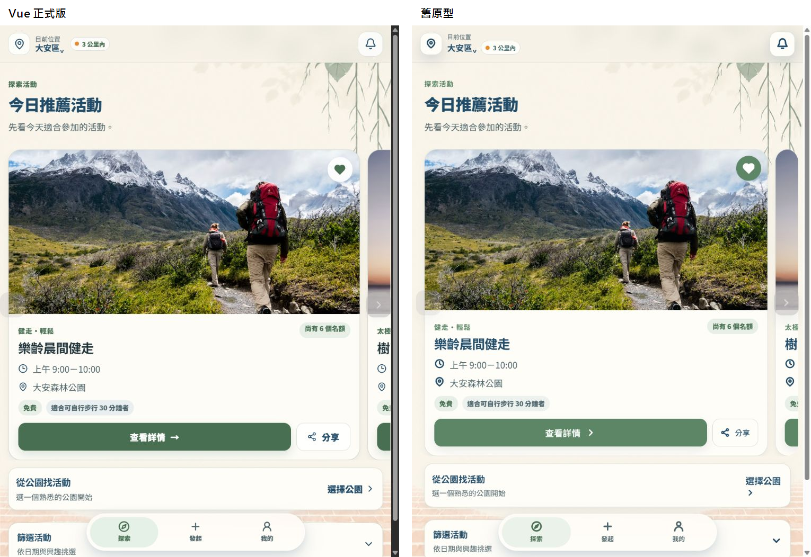
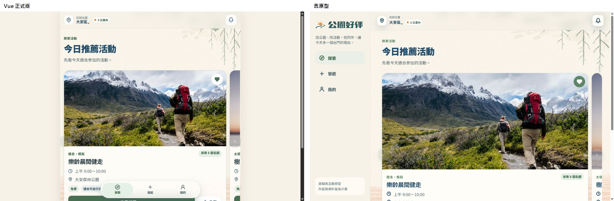

# 公園好伴｜探索頁 Vue 與舊原型互動／RWD 對照稽核

日期：2026-08-27  
範圍：`/explore` 首屏、推薦輪播、篩選入口、手機／平板／桌面 RWD  
裝置：360×640、390×844、768×1024、1280×800

## 總結

Vue 正式版的手機首屏視覺已接近舊原型，但互動與 RWD 還不能視為穩定。主要差距不是品牌樣式，而是以下三層尚未完整移植：

1. 桌面版殼層與側欄導覽。
2. 輪播與篩選的狀態管理。
3. 固定底部導覽的安全間距與焦點可見性。

## 步驟與健康狀態

### 1. 手機首屏（390×844）— 需要小幅修正

- 背景、頂部定位、推薦卡寬度、底部毛玻璃導覽大致一致。
- Vue 第一張卡高 440.1px；舊原型 415.1px。Vue 的所有輪播卡被最高卡片撐高，第一張底部多出約 25px。
- Vue 收藏狀態只有愛心填色；舊原型同時用綠色圓底強化已收藏狀態。
- Vue 主 CTA 使用文字箭頭 `→`；舊原型使用一致的 Chevron 圖示。

### 2. 手機篩選入口 — 高風險

- Vue 在最大可捲動位置時，篩選按鈕範圍約為 y=722.5–803.6；底部導覽由 y=760 開始，兩者重疊約 43.6px。
- 按鈕中心落在底部導覽內，正常點擊容易被導覽攔截；實測 Vue 未展開，舊原型可展開。
- Vue `FilterPanel` 以 `v-if` 直接掛載／卸載內容，沒有舊原型的展開動效。
- 「查看全部 15 種活動」目前沒有事件處理，屬於看得見但不能用的控制。

### 3. 平板（768×1024）— 可用但仍像放大的手機版

- 兩版均無水平溢位，視覺差距小。
- 推薦卡在平板上占用過多首屏高度；篩選入口被推至底部導覽附近。
- 可保留單欄，但建議限制推薦卡最大寬度／高度，避免單一卡片主宰整個畫面。

### 4. 桌面（1280×800）— 主要結構不一致

- Vue 在 800px 以上把整個 App 鎖成 760px 寬的置中手機畫布。
- 舊原型在 920px 以上切換為左側品牌導覽＋右側內容，並隱藏底部導覽。
- Vue 桌面版大量留白，底部導覽仍浮在活動卡上，沒有利用桌面寬度。

## 根因與優先修正

### P0｜先修正

1. **恢復桌面殼層**
   - 920px 以上新增 `SideNav`，隱藏 `BottomNav`。
   - `AppShell` 不再限制為 760px，內容區依可用寬度伸展並保留合理 max-width。

2. **補足底部安全空間**
   - `.explore-content` 不能用 40px 覆寫全域底部安全距離。
   - 手機底部至少保留 `導覽高度 + 40px + safe-area`，並設定捲動／焦點安全間距。

3. **讓輪播狀態成為 Vue 狀態**
   - 建立 `currentIndex`、`canPrevious`、`canNext`。
   - 使用 `scroll`／`scrollend` 與 `ResizeObserver` 同步手勢滑動後的按鈕狀態。
   - 第一張停用上一張，最後一張停用下一張。

### P1｜接著修正

4. **重做推薦卡等高策略**
   - 不讓較長的後續卡片在第一張下方製造空白。
   - 可採用卡片 body flex＋CTA 貼底，或限制推薦數量與文字行數。
   - 「今日推薦」建議只放 2–3 張精選；完整活動留給篩選結果。

5. **完成篩選互動**
   - 頻繁切換的內容保留在 DOM，以 `v-show`／`Transition` 控制展開。
   - Chevron 與內容使用一致的 220–320ms 動效，並遵守 reduced motion。
   - 補上「查看全部 15 種活動」展開／收合。

6. **補回可見回饋**
   - 收藏：填色＋短促縮放回饋。
   - 分享：原生分享不可用或取消時，提供可見 Toast／複製連結備援。

### P2｜品質收尾

7. 加入跳到主要內容連結，避免鍵盤使用者重複經過導覽。
8. 活動圖片提供明確 `width`／`height` 或比例資訊，降低載入位移。
9. 日期與興趣篩選同步到 URL query，支援返回、重新整理與分享篩選結果。
10. 建立 360、390、768、1280 四個視覺回歸尺寸，另測輪播首張／末張與篩選展開狀態。

## 建議元件邊界

- `AppShell`：決定 mobile/tablet/desktop 外殼。
- `SideNav`：桌面主要導覽。
- `RecommendationCarousel`：推薦列表、目前索引、箭頭與滑動。
- `useRecommendationCarousel`：捲動、ResizeObserver、可前進／後退狀態。
- `FilterPanel`：只負責篩選 UI；篩選值仍由父層傳入、事件傳回。
- `FeedbackToast`：收藏與分享的可見狀態回饋。

## 證據限制

- 已檢查視覺、滑動箭頭、篩選點擊、DOM 語意與原始碼。
- 尚未用螢幕閱讀器、實體 iOS Safari／Android Chrome 或 200% 縮放驗證，不能宣稱完整符合 WCAG。
